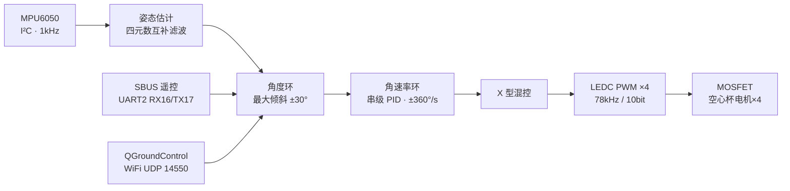

# ESP32 Mini Drone · ESP32 迷你四轴无人机复刻

[](https://www.espressif.com/)
[](https://www.arduino.cc/)
[](https://invensense.tdk.com/products/mpu-6050/)
[](https://mavlink.io/)
[](#-复刻进度)

基于开源飞控项目 [**okalachev/flix**](https://github.com/okalachev/flix) v1.2（约 2100 行 Arduino 代码的教学级 ESP32 四轴）的社区魔改源码，复刻嘉立创 OSHWHub 开源工程「[ESP32迷你无人机](https://oshwhub.com/malagis/esp32-mini-plane)」**V1.4 PCB**：ESP32 + GY-521（MPU6050）+ 空心杯电机 + MOSFET 驱动，通过 **WiFi 热点 + QGroundControl 手机虚拟摇杆**飞行。

> 本仓库 = 个人学习复刻工作区：硬件搭建记录 + 上游源码快照托管 + 二次开发。固件架构、数据流与工程化设计的分析笔记随制作推进持续更新。

---

## ⚠️ 版权与致谢

本仓库内容分属三方，各自保留全部权利：

| 内容 | 归属 | 说明 |
|---|---|---|
| 固件原始代码（`source/` 下 flix、gazebo、tools、docs） | © [Oleg Kalachev](https://github.com/okalachev) | 上游未附加许可证文件，代码版权归原作者所有 |
| MPU6050 适配 / 中文注释 / 编译说明 | © B站「[微辣火龙果](https://space.bilibili.com/544479100)」 | 对应嘉立创 OSHWHub 工程页的发布版本（2026-03-25） |
| 装机文档（`PROJECT_CONTEXT.md`）、README、后续二开内容 | Song Jie（[Indulge125](https://github.com/Indulge125)） | 本仓库维护部分 |

上游作者与社区版均已公开传播且允许学习修改；所有第三方文件原版权头原样保留。如版权方对本次托管有任何异议，将立即处理。

## 📂 目录结构

```text
├── PROJECT_CONTEXT.md                # 装机背景笔记：V1.4 构建路线、上电检查单、风险点
└── source/flix-v1.2-20260325/
    ├── flix1.2/                      # ★ 固件本体（Arduino 多文件 sketch）
    │   ├── flix1.2.ino               #   主程序 setup()/loop()
    │   ├── imu.ino                   #   IMU 驱动（第13/14行切换传感器型号）
    │   ├── estimate.ino              #   姿态估计：四元数互补滤波
    │   ├── control.ino               #   串级 PID 控制 + 模式/解锁逻辑
    │   ├── motors.ino                #   电机输出：78kHz PWM + X 型混控
    │   ├── wifi.ino / mavlink.ino    #   WiFi AP + MAVLink 遥测遥控
    │   ├── cli.ino / parameters.ino  #   命令行 shell + NVS 参数系统
    │   └── ...
    ├── gazebo/                       # Gazebo11 SITL 仿真（同一份固件代码跑物理仿真）
    ├── tools/                        # pyflix Python 控制库 / 日志抓取 / FFT 分析
    ├── docs/                         # 使用手册 + mdBook 教材章节
    └── Makefile                      # arduino-cli 构建/烧录/仿真入口（Linux/macOS）
```

## 🔁 固件数据流

主循环 ~1 kHz，由 IMU 数据就绪中断驱动节拍：



## 🔩 硬件方案（V1.4 PCB）

| 项目 | 方案 |
|---|---|
| 主控 | ESP32 DevKit V1（CH340 Type-C） |
| IMU | GY-521 模块，MPU6050，I²C（`imu.ino` 默认已启用该行） |
| 电机 | 8520 有刷空心杯 ×4，MOSFET（100N03A 同类）+10kΩ下拉 |
| 电源 | 3.7V LiPo，未装 5V 升压时须短接 R12 |

**电机接线（以代码 `motors.ino` 为准）：**

| 位置 | 引脚 | 转向/桨叶 |
|---|---|---|
| 左后 RL | GPIO12 | 逆时针 / B桨 |
| 右后 RR | GPIO13 | 顺时针 / A桨 |
| 右前 FR | GPIO15 | 逆时针 / B桨 |
| 左前 FL | GPIO14 | 顺时针 / A桨 |

> 注：上游 README 中 14/15 引脚表与本份魔改代码不一致，请以代码为准。

## 🚀 快速开始

### 编译烧录

1. 安装 Arduino IDE **≥ 2.3.x**（不支持 1.8.x），开发板管理器安装 `esp32 by Espressif Systems`（建议 3.x）
2. 库管理器安装 **FlixPeriph** 与 **MAVLink** 两个库 —— 不要额外安装其他 MPU/SBUS 类库，会冲突
3. 打开 `source/flix-v1.2-20260325/flix1.2/flix1.2.ino`，板型选 *ESP32 Dev Module* 或 *WEMOS D1 MINI ESP32*，编译上传
4. 串口监视器 115200 观察「程序初始化！」…「初始化完成」

详见 [`flix1.2/00源代码编译说明.txt`](source/flix-v1.2-20260325/flix1.2/00源代码编译说明.txt)；裸 ESP32 无外设也可烧录测试（WiFi 正常起热点即可验证固件）。

### 校准与试飞

| 步骤 | 操作 |
|---|---|
| 加速度计校准 | 串口发 `ca`，跟随提示完成六个面摆放（发送需带换行） |
| 加速度计查看 | `ps` 打印姿态角 / `imu` 查看 IMU 状态（约 1000Hz 即正常） |
| 无桨测电机 | `mfr` / `mfl` / `mrr` / `mrl` 分别低功率测试四个电机 |
| 手机控制 | 连接热点 **Drone_WiFi**（密码 12345678）→ QGroundControl 自动连接 → 启用*虚拟摇杆*、关闭*油门自动回中* |
| 解锁 | 油门最低时摇杆推至右下角；锁定推左下角 |

常用命令速查：`help` 全部命令 · `p` 参数读写 · `arm/disarm` · `stab/acro/auto` 模式 · `log` 导出飞行日志 · `sys` FreeRTOS 任务与内存 · `reboot`

## ✅ 复刻进度

- [x] 电源链路焊接与验证（BAT+/GND 短路检查、电池座极性）
- [x] 确认 R12 短接（未装 5V 升压模块时必须）
- [x] ESP32 DevKit 烧录固件成功
- [x] MPU6050 接入识别（`imu` 命令报 1000Hz、landed 标志正常翻转）
- [x] 加速度计六面校准（`ca`）
- [x] 四路 MOSFET 驱动电路
- [x] 无桨逐个电机测试并核对转向
- [x] （可选）SBUS 接收机接入与 `cr` 八步标定
- [x] 整机组装，最后装桨
- [x] QGC 虚拟摇杆悬停首飞

## ⛑️ 安全须知

- **首次上电、烧录、电机测试全程不装螺旋桨**
- 通电前实测 BAT+ 对 GND 不短路、电池座极性正确、3.3V 轨道电压正常后再插敏感模块
- 注意电机转向与 A/B 桨叶配对，装错必翻
- 锂电池使用安全规范照旧；本项目为 DIY，自担风险（见上游 [免责声明](https://github.com/okalachev/flix#disclaimer)）
